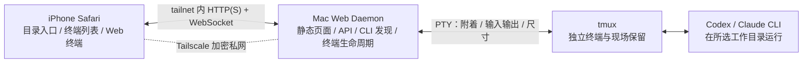

# 项目架构

状态：Web + Tailscale 首版设计基线，尚未实现或端到端验证。更新于 2026-09-20。

## 产品约束

iPhone Safari 通过 Tailscale 私有网络连接 Mac；手机找到工作目录后启动并操作 agent 原生 TUI；同一目录允许多个独立终端；手机页面或网络中断不终止电脑上的 agent，回来可以重新连接。

`project` 只是定位工作目录的说法，不建立 Project 实体、注册或绑定流程。agent 原生 session 负责对话历史，本产品仅管理终端进程与浏览器附着。首版不做协同调度，也不提供公开互联网访问。

## 组件与数据流



Tailscale 负责跨网络寻址、加密传输与 tailnet 访问控制；Web daemon 只服务私有网络，不开放公网入口。浏览器只维持当前终端的显示流，其他终端继续在 Mac 上运行。

## 建议技术基线

以下均是待验证的工程建议，不是已实现能力。

| 部分 | 建议 | 职责与理由 |
| --- | --- | --- |
| 手机客户端 | 响应式 Web UI + 浏览器终端组件 | Safari 直接使用；终端组件候选需通过 iPhone 输入与重绘验证 |
| Mac 服务 | Go 单进程，内嵌 Web 静态资源 | 提供页面、JSON API、WebSocket、CLI 发现、目录访问和终端桥接 |
| 私网接入 | Tailscale | 手机与 Mac 跨网可达，不自建公网 Relay、NAT 穿透或设备配对 |
| 终端宿主 | tmux，产品使用专用 socket/server | 让 agent 生命周期独立于网页与网络连接，支持重新附着 |
| 传输 | HTTP + WebSocket；目标为 tailnet 内 HTTPS + WSS | 控制消息和终端原始字节使用版本化协议；具体 HTTPS 入口由原型验证决定 |
| 数据 | Daemon 本地小型状态文件；浏览器本地偏好 | 只存目录捷径和终端元数据，不建立聊天数据库 |

## Tailscale 接入边界

首个原型必须比较两条路径，不能预先宣称其中之一已可用：

1. **直接 tailnet 访问**：Go 服务只绑定 Mac 的 Tailscale 地址，浏览器通过 MagicDNS 名称或 Tailscale IP 使用 HTTP/WS。Tailscale 链路本身加密，但浏览器将页面视为非 HTTPS，某些 Web 能力可能受限。
2. **Tailscale Serve**：Go 服务仅监听 `127.0.0.1`，Serve 提供 tailnet 内 HTTPS 并反向代理 WebSocket。它能应用 tailnet ACL 和附加身份头，但 2026 年仍有公开的 WebSocket 兼容性与稳定性问题，必须在目标 macOS、Tailscale 和 Safari 版本上实测。

若 Serve 验证失败，优先保留直接 tailnet HTTP/WS 原型；需要安全上下文时，再评估由 Go 服务直接终止 Tailscale HTTPS 证书或其他不公开到互联网的代理。首版禁止用 Tailscale Funnel 代替 Serve，因为 Funnel 会把服务暴露到公网。

无论采用哪条路径，服务都不能监听普通 LAN 或全部接口后仅靠“地址难猜”保护。首版访问授权依赖 tailnet 成员关系和 ACL；若未来引入其他用户，再单独设计应用层会话与权限。

## 关键职责边界

- Web UI：展示可用 agent、定位目录、启动或进入终端、传递输入和尺寸变化、显示连接状态。
- Daemon：以当前 Mac 用户身份执行认证后的目录与终端请求；不复制 provider 凭据到浏览器或 Tailscale 服务端。
- Tailscale：提供设备入网、加密连通、MagicDNS 与 ACL；不管理 agent、目录和终端。
- tmux：保留运行中的 agent 和终端现场。页面关闭或网络断开只移除附着客户端，不销毁 agent。
- Agent：模型调用、工具执行、权限确认、原生会话恢复。产品不解析 TUI 来生成任务状态，也不实现跨 provider 会话互转。

终端输出可能包含代码和凭据。Daemon 不记录输入输出正文；Tailscale 控制面不等于应用服务器，不应把 tailnet 身份 token 或 provider 凭据写入仓库。详见[通信协议](docs/protocol.md)。

## 标识与生命周期

| 标识 | 所属层 | 含义 |
| --- | --- | --- |
| `agent_id` | CLI 描述表 | 如 `codex`、`claude`，表示可启动的工具 |
| `terminal_id` | Daemon / tmux | 一个正在运行或已退出的终端实例，含启动目录 |
| `attachment_id` | 浏览器连接 | 一次临时终端附着，断线重连后更换 |
| agent 原生 session | agent 自己 | 对话历史与恢复，由 TUI/CLI 管理 |

恢复网页连接意味着重新附着 `terminal_id`，不等于新建 agent 对话。

## 代码目录

目标结构随实现逐步落地：

```text
cmd/daemon/               已创建占位入口；目标为 Mac Web daemon
internal/protocol/        已创建旧版 JSON envelope；实现时按新协议调整
internal/discovery/       后续：CLI 描述表和路径发现
internal/directories/     后续：工作目录浏览
internal/terminal/        后续：tmux、PTY、终端元数据和附着生命周期
internal/web/             后续：HTTP API、WebSocket 与静态资源服务
web/                      后续：响应式 UI 与浏览器终端
cmd/relay/                旧公网 Relay 占位入口，不属于当前首版
docs/                     产品、决策、运行时、协议、验证和开发文档
```

公网 Relay 占位入口暂时保留，但不属于当前首版实现目标。

## 第一条实现链路

先在 Mac 上运行最小 Go Web 服务，用 iPhone Safari 经 Tailscale 打开浏览器终端并操作 tmux 中的一个真实 agent；同时验证直接访问与 Tailscale Serve 的 WebSocket 行为。通过后再补目录入口、多终端、状态持久化与恢复。

当前最大未知是 iPhone Safari 终端交互以及 Tailscale Serve + WebSocket 的稳定性。具体退出条件见[验证计划](docs/validation.md)。
