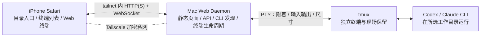

# 项目架构

状态：Web + Tailscale 首版设计基线；移动端控制台、多个独立终端、显式结束与 tmux/Codex 原生 session 恢复原型已实现，真实 iPhone 已通过直接 tailnet 与 Serve 基础连接，结束/恢复交互及长连接仍待验收。更新于 2026-09-24。

## 产品约束

iPhone Safari 通过 Tailscale 私有网络连接 Mac；手机找到工作目录后启动并操作 agent 原生 TUI；同一目录允许多个独立终端；手机页面或网络中断不终止电脑上的 agent，回来可以重新连接。

`project` 只是定位工作目录的说法，不建立 Project 实体、注册或绑定流程。agent 原生 session 负责对话历史，本产品仅管理终端进程与浏览器附着。首版不做协同调度，也不提供公开互联网访问。

## 组件与数据流


```mermaid
flowchart LR
    B["iPhone Safari\n目录入口 / 终端列表 / Web 终端"] <-->|"tailnet 内 HTTP(S) + WebSocket"| W["Mac Web Daemon\n静态页面 / API / CLI 发现 / 终端生命周期"]
    B -. "Tailscale 加密私网" .- W
    W <-->|"PTY：附着 / 输入输出 / 尺寸"| T["tmux\n独立终端与现场保留"]
    T <--> A["Codex / Claude CLI\n在所选工作目录运行"]
```

Tailscale 负责跨网络寻址、加密传输与 tailnet 访问控制；Web daemon 只服务私有网络，不开放公网入口。浏览器只维持当前终端的显示流，其他终端继续在 Mac 上运行。

macOS 分发先采用一键源码安装：安装器在本机取得当前 checkout 或仓库 `main`，补齐缺少的 Go/tmux 后构建内嵌 Web 资源的 daemon，将二进制放到当前用户的 `~/.local/bin`。安装与运行分开，安装器不启动服务、不配置 Tailscale Serve、也不触碰 tmux/agent 会话。依据是用户 2026-09-25 对“安装包或者一键安装”的要求；运行拓扑及私网监听合同保持上述设计。

## 建议技术基线

以下是当前工程基线；表中已落地部分仍需按验证计划完成真机与长连接验收。

| 部分 | 建议 | 职责与理由 |
| --- | --- | --- |
| 手机客户端 | 响应式 Web UI + xterm.js 6.0.0 / fit addon 0.11.0 | Safari 直接使用；依赖随 Go 二进制内嵌，仍需通过 iPhone 输入与重绘验证 |
| Mac 服务 | Go 单进程，内嵌 Web 静态资源 | 提供页面、JSON API、WebSocket、CLI 发现、目录访问和终端桥接 |
| 私网接入 | Tailscale | 手机与 Mac 跨网可达，不自建公网 Relay、NAT 穿透或设备配对 |
| 终端宿主 | tmux，产品使用专用 socket/server | 让 agent 生命周期独立于网页与网络连接，支持重新附着 |
| 传输 | HTTP + WebSocket；目标为 tailnet 内 HTTPS + WSS | 控制消息和终端原始字节使用版本化协议；具体 HTTPS 入口由原型验证决定 |
| 数据 | 专用 tmux session 名称；浏览器本地偏好 | tmux 是当前运行终端的恢复事实源；浏览器只记住当前 `terminal_id`，不建立聊天数据库 |

## Tailscale 接入边界

首个原型必须比较两条路径，不能预先宣称其中之一已可用：

1. **直接 tailnet 访问**：Go 服务只绑定 Mac 的 Tailscale 地址，浏览器通过 MagicDNS 名称或 Tailscale IP 使用 HTTP/WS。Tailscale 链路本身加密，但浏览器将页面视为非 HTTPS，某些 Web 能力可能受限。
2. **Tailscale Serve**：Go 服务仅监听 `127.0.0.1`，Serve 提供 tailnet 内 HTTPS 并反向代理 WebSocket。它能应用 tailnet ACL 和附加身份头，但 2026 年仍有公开的 WebSocket 兼容性与稳定性问题，必须在目标 macOS、Tailscale 和 Safari 版本上实测。

若 Serve 验证失败，优先保留直接 tailnet HTTP/WS 原型；需要安全上下文时，再评估由 Go 服务直接终止 Tailscale HTTPS 证书或其他不公开到互联网的代理。首版禁止用 Tailscale Funnel 代替 Serve，因为 Funnel 会把服务暴露到公网。

无论采用哪条路径，服务都不能监听普通 LAN 或全部接口后仅靠“地址难猜”保护。首版访问授权依赖 tailnet 成员关系和 ACL；若未来引入其他用户，再单独设计应用层会话与权限。

## 关键职责边界

- Web UI：以独立上下文条展示当前工作目录与 agent，以可直接输入的原生 TUI 卡片呈现权威运行现场；可浏览路径，并在所选 cwd 新建、切换或经确认后结束独立终端。Codex 模式额外列出当前 cwd 的原生历史名称、恢复到新终端，并可触发 `/model`、原生 `/` 菜单及少量明确快捷指令。
- Daemon：以当前 Mac 用户身份执行认证后的目录与终端请求；不复制 provider 凭据到浏览器或 Tailscale 服务端。
- Tailscale：提供设备入网、加密连通、MagicDNS 与 ACL；不管理 agent、目录和终端。
- tmux：保留运行中的 agent 和终端现场。页面关闭或网络断开只移除附着客户端，不销毁 agent。
- Agent：模型调用、工具执行、权限确认、原生会话恢复。产品不解析 TUI 来生成任务状态，也不实现跨 provider 会话互转。

浏览器终端按 ANSI/SGR 渲染 agent 原生样式，包括 256 色、粗体、暗色、下划线和反色；终端协议不携带任意字体族或富文本组件。Daemon 启动新 agent 时保留用户环境，但只移除与彩色终端目标直接冲突的 `NO_COLOR`，不改写 `HOME`、`CODEX_HOME` 或权限参数。

移动端终端视觉以本机 Ghostty 默认配置为参考：xterm.js 使用随二进制内嵌的 JetBrains Mono Regular/Bold、对应暗色 ANSI 调色板和紧凑行距。浏览器字体加载完成后再创建终端，避免 xterm 缓存备用字体的错误单元格宽度；中文继续使用系统 CJK 等宽回退。页面缩短顶栏、上下文条，移除重复输入框，并让终端区域占用剩余高度，不改变终端字节流或原生 TUI 的内容边界。

xterm.js 的 DOM renderer 会在运行时创建页内样式表，用于 ANSI 前景色、背景色及粗体。Web 响应的 CSP 对样式允许同源资源与页内样式，否则终端字节和 DOM class 虽然正确，浏览器仍把所有文字画成同色同重；脚本、连接、图片等 CSP 限制保持原有边界。

iOS 中文输入法可能在 `keydown` 只报告 `keyCode=229`，空格和标点到 `input/keyup` 才出现；[xterm.js 上游问题 #5835](https://github.com/xtermjs/xterm.js/issues/5835) 记录了漏发症状。当前固定的 xterm.js 6.0.0 继续负责常规输入；浏览器仅在 iOS 上对这种按键序列补发 xterm 未发出的单个空格或标点，并在 xterm 已发数据或正在组词时跳过。事件序列单测、构建检查已通过，2026-09-25 用户在 iPhone Safari 重新打开更新后的 daemon 页面后确认 `/` 与空格可输入。Go 二进制内嵌网页资源，重建后必须重启仍在运行的 daemon 才能交付新脚本。

2026-09-26 用户要求在手机底部增加 Esc、粘贴和 Ctrl+C，以减少长按原生输入栏的操作。快捷键直接经现有 `terminal.input` 发送 ESC/ETX 字节；粘贴由浏览器读取纯文本后交给 xterm.js 的 `paste()`，沿现有 `onData` 路径发送，遵循终端当前的 bracketed-paste 模式且不追加回车。发送前沿用 `terminal.focus` 返回 tmux 实时画面，不弹出新的输入框。剪贴板读取依赖 Safari 的安全上下文和授权；直接 tailnet HTTP 页面无法承诺一键读取，页面会说明需要私有 HTTPS，原生长按粘贴仍可用。单次粘贴限 40 KiB UTF-8，以免 base64 后超过服务端 64 KiB WebSocket 帧上限。用户已确认手机端快捷按钮可工作；HTTPS 剪贴板授权边界和更多键盘布局仍待验收。

同日用户反馈手机无法按 Codex 在论文对话中提示的 F3。底部增加“查找 F3”，通过原有 `terminal.input` 发送 xterm F3 序列 `ESC O R`，让 Codex 自行处理原生对话搜索；不读取或索引终端正文。`xterm-256color` 的 `kf3` 与该序列一致，Node 行为测试通过；真实 iPhone 点击后的 Codex 搜索仍待验收。

PTY 附着 tmux 时显式使用全局 `-u` 选项输出 UTF-8。2026-09-24 在无 `LANG/LC_*` 的 launchd daemon 中复现：不带此选项时，tmux 内部保存的中文正确，但附着客户端收到等宽下划线；带 `-u` 后客户端收到原始中文 UTF-8。此修复只影响附着输出编码，不修改 agent 环境或原生会话。

网页预组装的 Codex 原生快捷指令使用终端 bracketed-paste 起止序列包住指令正文，再在需要提交时追加回车。依据 2026-09-21 的真实链路复现，直接把 `/model\r` 作为同一批普通字节写入只会把文字留在 Codex 输入框；显式 paste 结束边界后 Codex 才能区分正文与提交键。浏览器终端内直接键入的字节仍原样转发。

tmux copy mode 的定位光标与 Codex 输入光标是两种位置。浏览器在终端失焦时隐藏前者；轻点原生输入结束后，daemon 精确检查该终端的 `#{pane_in_mode}`，仅在回滚中用 `send-keys -X cancel` 返回实时画面，然后让按键继续进入 agent。触摸滑动不会触发这个返回动作。2026-09-26 用户反馈首次聚焦后需输入字符才能看到 Codex 输入栏：旧判断只比较 `visualViewport.height` 与同时缩小的 `innerHeight`，可能一直不进入紧凑布局。iPhone 上聚焦原生输入栏时立即启用紧凑布局，视口和窗口 resize 再用当前可见高度调整终端；真实键盘动画仍待复验。

用户随后复验确认论文会话的滑动已正常，但首次聚焦仍看不到输入栏。继续检查发现移动端 `.terminal-card` 原设为 `flex: 1 0 340px`，聚焦样式只改了 flex basis，收缩系数仍为 0；键盘压缩可用高度后卡片仍可能溢出可见区域。聚焦样式现明确设为可收缩的 `flex: 1 1 0`，保留视口高度更新；真实 Safari 结果待再次复验。

2026-09-26 调查 AI infra 的 Codex 论文会话：新版 Codex pane 的 `alternate_on=1`、`mouse_any_flag=1`、`history_size=0`，旧 `WheelUpPane` 固定进入 tmux copy mode 后没有旧行可滚。tmux 现在只在 pane 请求鼠标事件时用 `send-keys -M` 把滚轮交给原生 TUI；不请求鼠标事件的旧 pane 仍进 tmux copy mode。隔离 tmux 已验证绑定语法，用户随后确认真实 iPhone 上的论文会话可以上下滑动。

终端输出可能包含代码和凭据。Daemon 不记录输入输出正文；Tailscale 控制面不等于应用服务器，不应把 tailnet 身份 token 或 provider 凭据写入仓库。详见[通信协议](docs/protocol.md)。

## 标识与生命周期

| 标识 | 所属层 | 含义 |
| --- | --- | --- |
| `agent_id` | CLI 描述表 | 如 `codex`、`claude`，表示可启动的工具 |
| `terminal_id` | Daemon / tmux | 一个正在运行或已退出的终端实例，含启动目录 |
| `attachment_id` | 浏览器连接 | 一次临时终端附着，断线重连后更换 |
| agent 原生 session | agent 自己 | 对话历史与恢复，由 TUI/CLI 管理 |

恢复网页连接意味着重新附着 `terminal_id`，不等于新建 agent 对话。

显式结束 `terminal_id` 会精确终止对应的产品受控 tmux session，并使当前浏览器附着失效；它不删除 agent 原生 session。手机仍可通过 Codex `thread/list` 找到保存的历史，并以 `codex resume <id>` 在新终端中继续对话。页面离开、WebSocket 断开和显式结束必须保持不同语义。

## 代码目录

目标结构随实现逐步落地：

```text
cmd/daemon/               可运行的多终端 Mac Web daemon 原型
internal/protocol/        已创建旧版 JSON envelope；实现时按新协议调整
internal/discovery/       后续：CLI 描述表和路径发现
internal/terminal/        已实现 tmux session catalog、恢复、显式结束、PTY 附着和每终端单写附着替换
internal/codex/           通过官方 app-server thread/list 读取 Codex 原生历史元数据
internal/directory/       工作目录规范化与有界的直接子目录浏览
internal/web/             已实现内嵌 xterm.js、终端 list/create/delete API 与动态 WebSocket 桥接
cmd/relay/                旧公网 Relay 占位入口，不属于当前首版
docs/                     产品、决策、运行时、协议、验证和开发文档
```

公网 Relay 占位入口暂时保留，但不属于当前首版实现目标。

## 第一条实现链路

当前已从单终端链路推进到多个 cwd 的多终端：`prototype` 保留现有会话，新建终端使用 `session-<12hex>` tmux 名称；每个新 session 以 tmux user option 保存规范 cwd，daemon 重启后只恢复专用 socket 中这两个受控命名空间，不接管用户其他 tmux。旧 session 缺少 cwd 元数据时回退到 daemon 默认目录。2026-09-26 实际 launchd 重启时发现 tmux 在无 UTF-8 locale 下把格式字符串中的 tab 转为下划线，导致 catalog 静默跳过已有 session；列表输出现改用 `|` 分隔，并只切分前两个边界，以保留 cwd 和 pane title 内部的竖线。tmux 中的原 session 始终存活，新版 daemon 重启后 API 已重新列出全部 9 个 session。

当前最大未知是 iPhone Safari 终端交互以及 Tailscale Serve + WebSocket 的稳定性。具体退出条件见[验证计划](docs/validation.md)。

当前页面通过 `GET /api/v1/context` 读取默认上下文，并从终端列表切换到各自的 agent、cwd、终端 ID 及由 cwd basename 派生的工作区显示名。目录 API 只按需返回直接子目录；创建 API 验证提交路径后用 tmux `-c` 启动。终端列表还读取 tmux `pane_title` 作为可选的 agent 原生会话标题；它是 TUI 主动提供的终端元数据，不来自正文解析，也不表示任务状态。接口不读取 provider 会话文件；模型只标记为 native session，`/model` 选择仍完全发生在原生 TUI。页面不建立产品聊天数据库或重复的已发送命令列表。

移动端顶部横向标签复用上述终端列表，包含所有 cwd 的运行终端。点击标签只更新浏览器选中的 `terminal_id`、对应上下文及 WebSocket 附着；顶部加号沿用现有创建 API，在当前 cwd 新建终端。底部对话面板继续提供显式结束和 Codex 原生历史恢复。标签不保存独立对话数据，也不结束切走的 tmux session。依据是用户 2026-09-24 对“移动端顶部多个 tab、可跨工作目录”的明确需求。

原型将 xterm.js 的 ESM 发布文件、样式与 MIT 许可证，以及 JetBrains Mono WOFF2 与 OFL 许可证固定在仓库中并嵌入 Go 二进制，不从 CDN 加载；这样手机只需要访问 Mac 的私有服务，运行时不依赖公网或 Node。版本升级必须重新执行真机输入与重绘验收。
